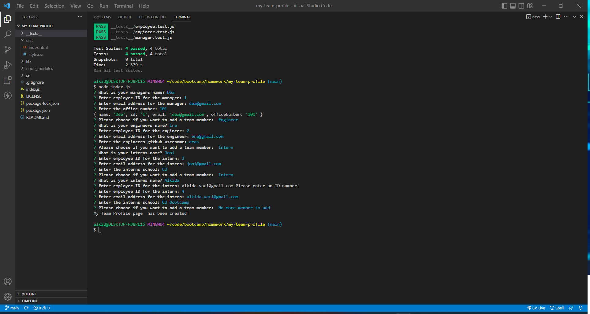
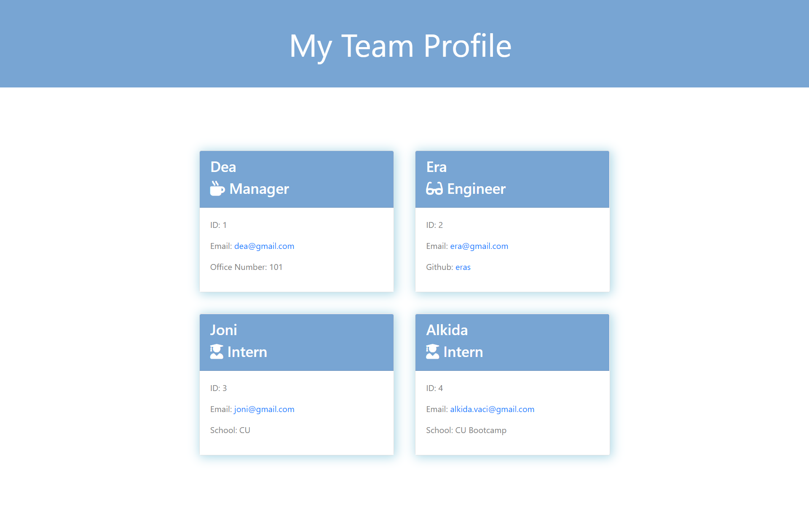

# My Team Profile
   
  ## Table of Contents
  - [Description](#description)
  - [Installation](#installation)
  - [Usage](#usage)
  - [Contributing](#contributing)
  - [Questions](#Questions)
  

  ## Description
  🔍 This application is a node.js that uses user input from inquirer to create html file to display team profiles. User is asked to enter the manager name, id, email and office number. Than user can choose to add an engineer, an intern or to finish entering members. For each engineer user is asked to enter name, id, email and github username. For each intern user is asked to enter name, id, email and the name of the school. 

  
  ## Installation
  💾 Run npm install in order to install the following npm package dependencies.
    

  
  ## Usage
  
   
  💻 When you run node index.js, the application uses the inquirer package to prompt you in the command line with a series of questions about your team members.
    

  ## License 
  
    
     
  ## Questions
  ✋ Feel free to contact me for any questions: 
  
  ✉️ Email me with any questions: [alkida.vaci@gmail.com](alkida.vaci@gmail.com) 
  :octocat: Find me on GitHub: [alkidavaci](https://github.com/alkidavaci)